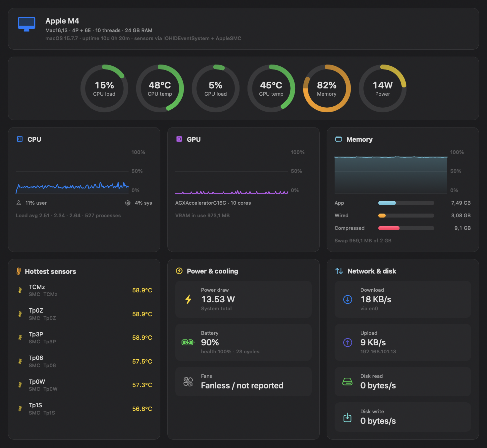
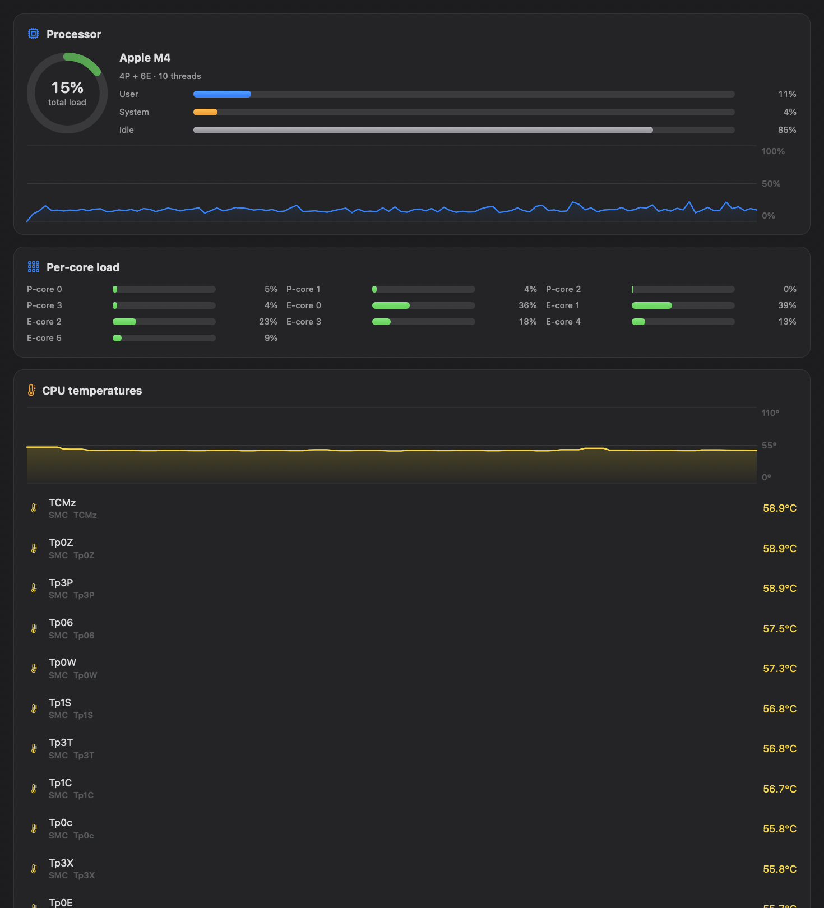
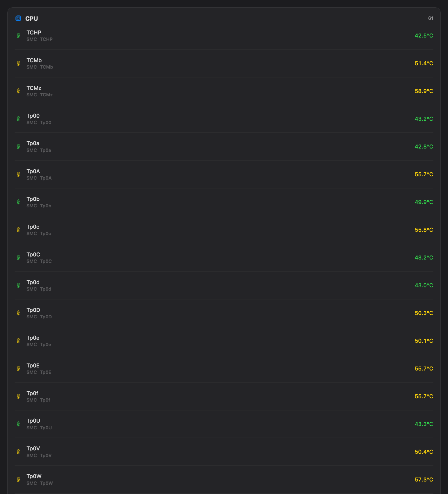
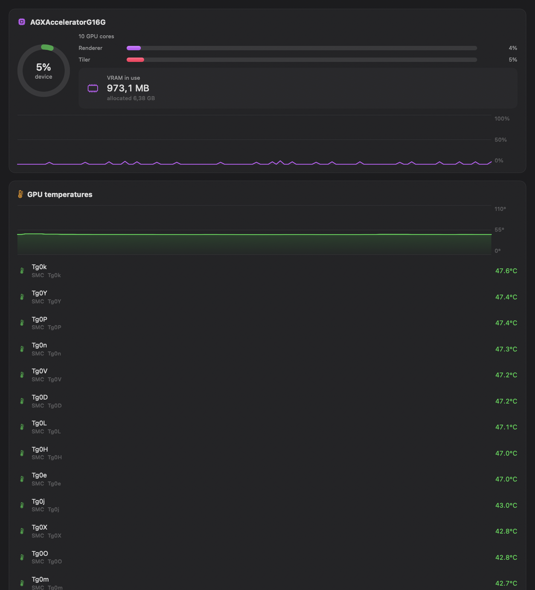
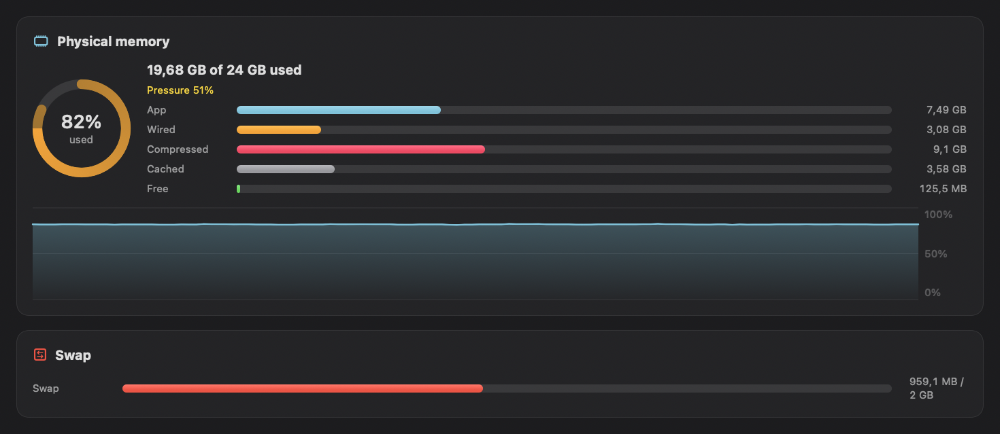
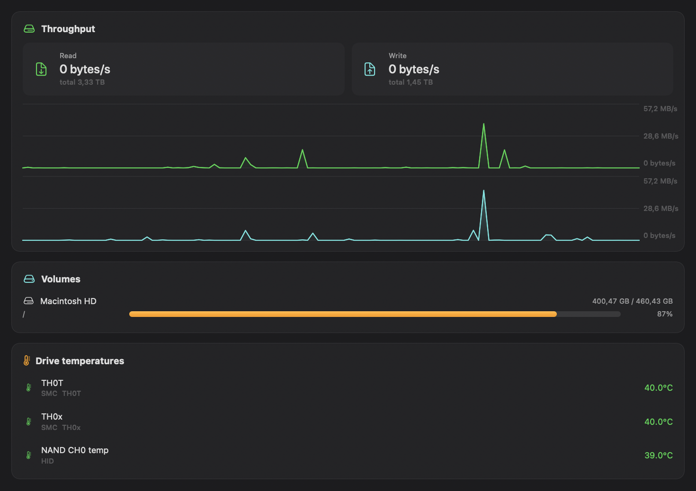
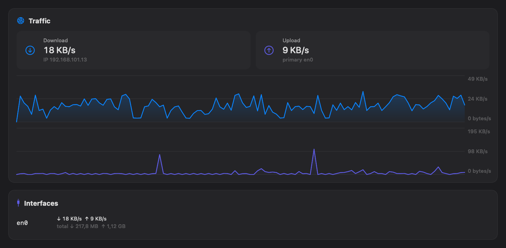
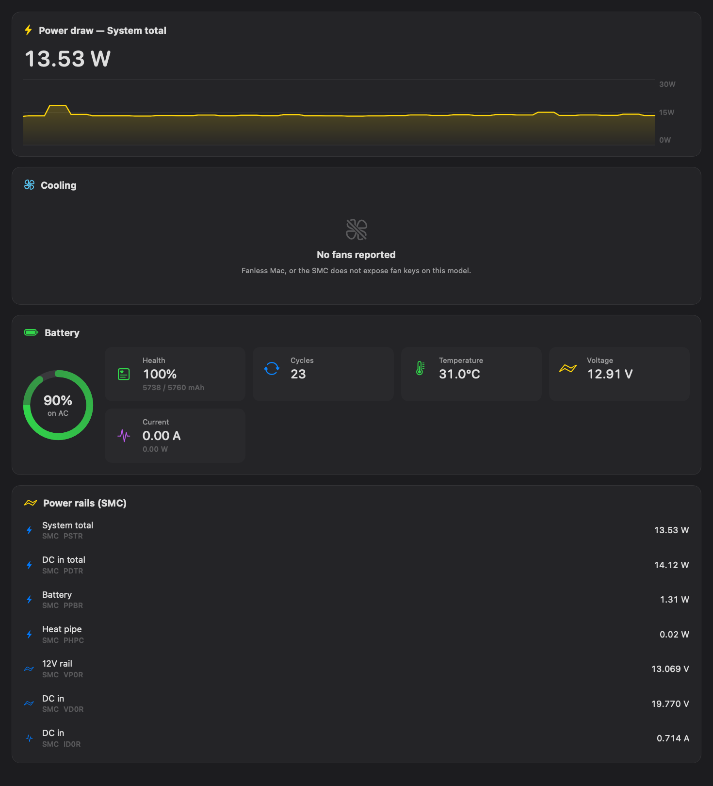

# PC Monitor for Mac

A system monitor for the Mac. CPU and GPU temperatures, per-core load, memory, disks, network,
fans, power draw and battery. There is also a tab that lists every sensor the machine exposes
through `IOHIDEventSystem` and `AppleSMC`, which on an M4 comes to roughly 350 of them.


## Requirements

macOS 14 or later and Xcode 15+. Built and tested on macOS 15.7.7 with Xcode 26.3

## Running it

From the project root:

```bash
make run
```

That builds a release binary, wraps it in `.build/release/PC Health.app` and opens it. You get
a window with the dashboard and a menu bar item showing the current temperature.

The other targets:

```bash
make app          # build the bundle without opening it
make install      # copy the app to /Applications
make icon         # redraw the icon (Scripts/GenerateIcon.swift)
make screenshots  # regenerate the images below
make clean        # delete the build
```

`open Package.swift` works if you prefer Xcode, since this is a plain SwiftPM package. Launch it
with `make run` anyway: the menu bar item and the Dock icon need a real `.app` bundle and won't
show up when you run the bare binary out of `.build/`.

The bundle is signed ad-hoc on your machine, so nothing prompts you the first time you open it.
Reading the sensors goes through IOKit and does not need admin rights.

### Controls

* the °C / °F switch and the sample interval (1, 2, 5 or 10 seconds) are in the toolbar
* ⌘R takes a reading now, ⇧⌘P pauses and resumes sampling
* the All sensors tab has search over names and SMC keys, a filter by type, and CSV export

### Without the window

```bash
make dump     # one reading as text
make json     # the same reading as JSON, handy for scripts
make bench    # how many milliseconds a sampling pass costs
```

## What it looks like

Dashboard: load and temperature rings, charts, the hottest sensors, power, network and disk.



CPU: load per core (performance cores first, then efficiency cores), temperatures, load average,
uptime.



All sensors: everything the machine reports, grouped, with search, filtering and CSV export.



<details>
<summary><b>The rest of the tabs</b>: GPU, Memory, Storage, Network, Power &amp; Fans</summary>

GPU: utilisation, core count, video memory, temperatures.



Memory: app, wired, compressed, cached and free, memory pressure, swap.



Storage: read and write throughput, how full each volume is, drive temperatures.



Network: throughput and byte counters per interface.



Power & Fans: watts, fan speeds, battery, and the SMC power rails.



</details>


Everything comes straight from the system: `AppleSMC` and `IOHIDEventSystem` for the sensors,
`host_processor_info` for core load, `IOAccelerator` for the GPU, `host_statistics64` for memory,
`getifaddrs` for the network and `IOPowerSources` for the battery. The details are in the
comments in [Sources/PCHealth/Services/](Sources/PCHealth/Services/).

## Notes

* It only reads. Nothing is ever written to the SMC, so there is no fan control here.
* Intel Macs work fine. The sensors come from the SMC there, and `HID=false` in the output is
  expected rather than a failure.
* On fanless models the SMC reports no fans at all and the Cooling section says so.
* A sampling pass costs about 70 ms. With the window open the app sits at 2-5% CPU on a two
  second interval.
